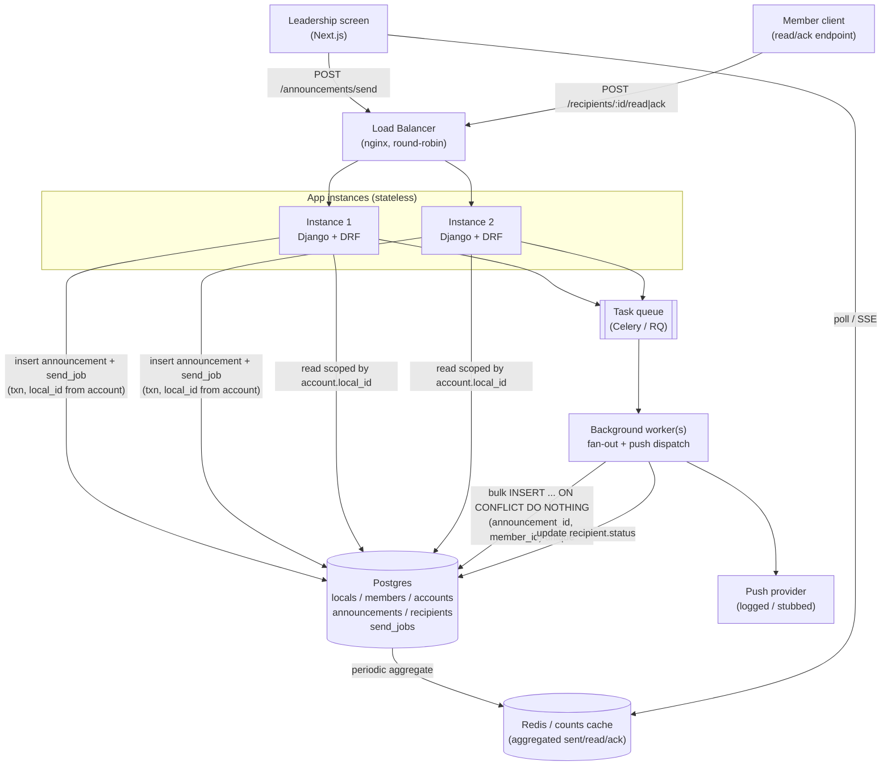

# Architecture Diagram

**Notes**
- Both app instances are stateless and interchangeable — either can receive any request, which is what the load-balancer bonus exercises.
- The uniqueness that prevents double-send lives in Postgres (`send_jobs.announcement_id` unique, `recipients(announcement_id, member_id)` unique), not in any single process's memory — so it holds no matter which instance handles a retry.
- The counts cache exists specifically so four people watching the live screen don't each trigger a full `COUNT(*)` over recipients every second.